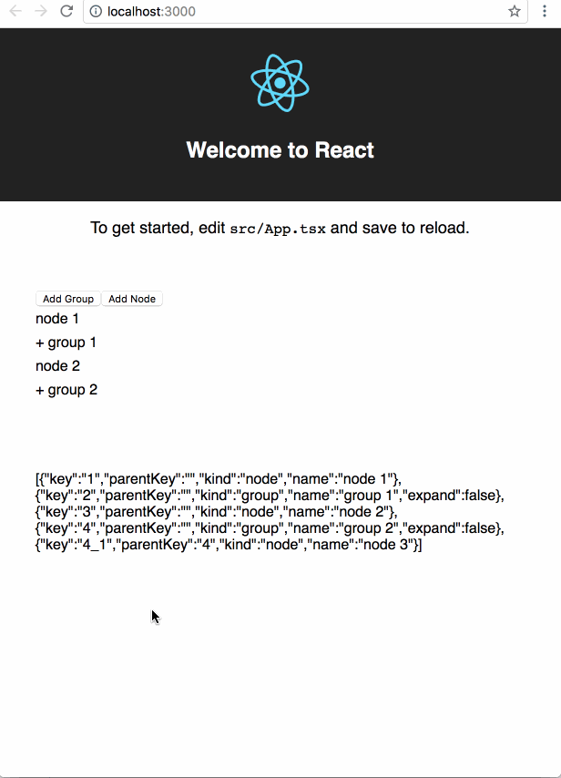
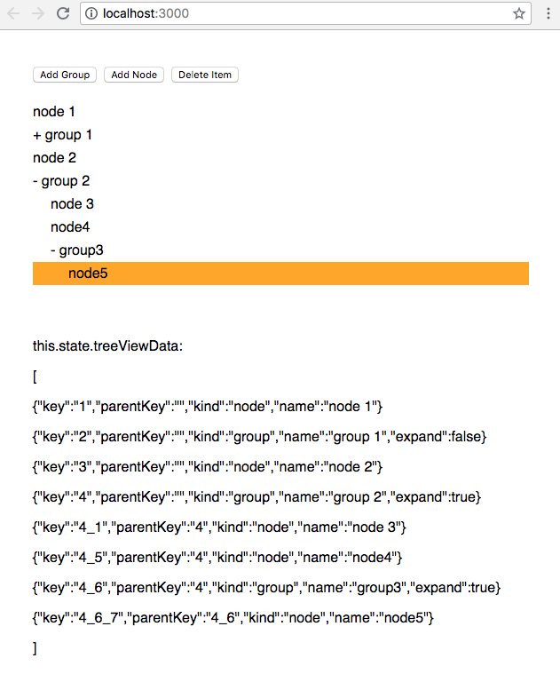

# React TreeView with flat data structure

Instead of using nested data structure, for example, each tree view item data has a children property, we use the flat data structure, keep them same as in the database, each child item has a parentKey property points to its parent item data.

An example uses nested data structure - [rc-tree](http://react-component.github.io/tree/examples/basic.html):

    const treeData = [
      { key: '0-0', title: 'parent 1', children:
        [
          { key: '0-0-0', title: 'parent 1-1', children:
            [
              { key: '0-0-0-0', title: 'parent 1-1-0' },
            ],
          },
          { key: '0-0-1', title: 'parent 1-2', children:
              [
                { key: '0-0-1-0', title: 'parent 1-2-0', disableCheckbox: true },
                { key: '0-0-1-1', title: 'parent 1-2-1' },
              ],
          },
        ],
      },
    ];

    <Tree
      ...
      treeData={treeData}
    />

Our usage:

    treeViewData: [
      {key: '1',   parentKey: '',  kind: 'node',  name: 'node 1'},
      {key: '2',   parentKey: '',  kind: 'group', name: 'group 1', expand: false},
      {key: '3',   parentKey: '',  kind: 'node',  name: 'node 2'},
      {key: '4',   parentKey: '',  kind: 'group', name: 'group 2', expand: false},
      {key: '4_1', parentKey: '4', kind: 'node',  name: 'node 3'}
    ],

    <TreeView
      data={treeViewData}
      rootParentKey=''
      .../>

This project is generated by [Microsoft/TypeScript-React-Starter](https://github.com/Microsoft/TypeScript-React-Starter) scaffold.

## Demo

## TODO

- [ ] Make renderItem open
- [x] Add more documentation
